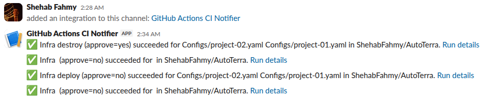
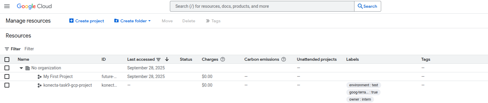

# AutoTerra: Automated GCP Infrastructure Deployment with Terraform and YAML

**AutoTerra** is a framework that automates the deployment of Google Cloud Platform (GCP) infrastructure using **Terraform** and **YAML**.
Instead of manually writing Terraform code for each environment, you define your resources once in a simple YAML file. A Python automation script then parses it, generates the required Terraform configuration, and applies it to your GCP account.

This project was inspired by the [Terraform_Auto_Intern_Project.md](Terraform_Auto_Intern_Project.md) specification, which aimed to simplify and accelerate the setup of new GCP projects.

## Key Features

- **YAML-Based Configuration** – Define complete GCP environments in a single, readable YAML file.
- **Dynamic Terraform Generation** – Only includes the Terraform code and modules relevant to your configuration.
- **Isolated Environments** – Each deployment has its own directory and Terraform state to prevent conflicts.
- **Fully Automated Workflow** – Python scripts handle reading, generation, and execution (apply/destroy).
- **Modular and Reusable** – Built from Terraform modules that can be easily maintained and extended.
- **CI/CD Ready** – GitHub Actions workflow automates deployment and destruction from commits or manual triggers.

---

## Supported GCP Resources

AutoTerra supports the following GCP services through dedicated Terraform modules:

  * **GCP Project**: Creates a new project and links billing.
  * **VPC Network**: Provisions a Virtual Private Cloud.
  * **Subnets**: Creates subnets within the VPC.
  * **Routes**: Defines custom network routes.
  * **Firewall Rules**: Manages ingress/egress rules.
  * **Compute Instances**: Deploys virtual machines.
  * **Persistent Disks**: Creates standalone compute disks.
  * **Static IPs**: Reserves internal or external static IP addresses.
  * **Service Accounts**: Manages IAM service accounts.
  * **Cloud DNS**: Creates public or private DNS zones and record sets.
  * **Cloud Storage**: Provisions GCS buckets with versioning and labels.
  * **Load Balancers**: Sets up external and internal HTTP(S) load balancers.

---

## How It Works: The Template Engine

The project uses a dynamic generation process to create an isolated Terraform environment for each deployment.

1.  **YAML as Input**: You define the desired resources in a `.yaml` file in the `Configs/` directory.
2.  **Directory Creation**: The `deploy.py` script reads your YAML and creates a new directory named after the `project_id` specified within it. This directory will contain all the necessary Terraform files for that specific deployment.
3.  **Template Copying**: The script treats the root `main.tf`, `variables.tf`, and the `Modules/` directory as **templates**. It intelligently filters these files and copies only the relevant code and module folders into the newly created project directory. For example, if your YAML doesn't define any `gcs_bucket`, the GCS module and its corresponding variable definitions won't be copied.
4.  **Isolated State**: This process ensures each deployment is self-contained in its own folder with its own Terraform state file, preventing conflicts between different environments.

---

## Project Structure

The repository is organized to separate configuration, automation logic, and Terraform modules.

```
.
├── Configs/                  # Contains example YAML files that define the infrastructure for each project.
│   ├── project-01.yaml
│   └── project-02.yaml
├── main.tf                   # Reference for deploy.py to copy root Terraform modules.
├── variables.tf              # Reference for deploy.py to copy root Terraform variables.
├── Modules/                  # Reusable Terraform modules for creating specific GCP resources.
│   ├── project/
│   ├── vpc/
│   ├── subnet/
│   │   ... (and other resource modules)
├── Scripts/                  # Contains the Python scripts used to automate the Terraform workflow.
│   ├── deploy.py
│   ├── destroy.py
│   └── helper_functions.py
├── .github/workflows/        # GitHub Actions workflow that runs the deploy/destroy scripts based on commit messages.
│   └── infrastructure-deploy.yml
├── README.md                 # The main documentation file explaining the project's purpose, setup, and usage.
└── README-CI.md              # A detailed guide explaining how the CI/CD workflow operates.
```

---

## Automation Scripts

The core logic of this project resides in the Python scripts located in the `Scripts/` directory.

### `deploy.py`
This script orchestrates the creation of infrastructure. Its primary functions are:
* To read and parse the user-provided YAML configuration file.
* To create a new, isolated project directory based on the `project_id`.
* To generate deployment-specific `main.tf` and `variables.tf` files by copying only the necessary blocks from the root templates.
* To copy the required module folders from the root `Modules/` directory into the new project directory.
* To convert the YAML data into a `terraform.tfvars` file that Terraform can understand.
* To run `terraform init` and `terraform apply`, prompting the user for final approval before making any changes to the cloud environment.

### `destroy.py`
This script is responsible for tearing down the infrastructure.
* It targets the specific project directory that corresponds to the input YAML file.
* It runs the `terraform destroy` command after receiving user confirmation.
* It prompts for a **destroy scope**, allowing you to either destroy the cloud resources while keeping the local configuration folder (`modules`) or destroy both the cloud resources and the local folder (`all`).

### `helper_functions.py`
This is a utility script that contains shared functions to keep the code DRY (Don't Repeat Yourself).
* It includes a function to safely read and parse YAML files, which is used by both `deploy.py` and `destroy.py`.
* It contains the function for running Terraform commands as a subprocess, handling user interaction for apply/destroy approvals.

---

## Configuration Example

All infrastructure is defined in a YAML file within the [Configs/](Configs/) directory. You can create a new file or modify an existing one like [project-01.yaml](Configs/project-01.yaml).

The file is structured with top-level keys that correspond to the Terraform modules used for deployment.

### Example: `Configs/project-01.yaml`

```yaml
project:
  project_name: "konecta-task9-gcp-project-3"
  project_id: "konecta-task9-gcp-project-id-3"
  billing_account: "XXXXXX-XXXXXX-XXXXXX"
  deletion_policy: "DELETE"
  labels:
    owner: intern
    environment: test
  apis:
    - compute.googleapis.com
    - iam.googleapis.com

vpc_name: "konecta-task9-vpc"

subnets:
  konecta-task9-pb-subnet:
    cidr: "10.0.1.0/24"
    region: "us-central1"
  konecta-task9-pv-subnet:
    cidr: "10.0.2.0/24"
    region: "us-central1"

firewall_rules:
  allow-ssh:
    protocol: "tcp"
    ports: ["22"]
    source_ranges: ["203.0.113.25/32"]

compute_instances:
  konecta-task9-pb-vm:
    machine_type: "e2-medium"
    zone: "us-central1-a"
    image: "debian-cloud/debian-12"
    network: "konecta-task9-vpc"
    subnetwork: "konecta-task9-pb-subnet"
    assign_public_ip: true
    tags: ["ssh", "web"]

# ... other resources like load_balancers, gcs_bucket, etc.
```

---

## Prerequisites

Before running AutoTerra, make sure you have:

1.  **Terraform**: Version `1.6.0` or later.
2.  **Python**: Version `3.11` or later.
3.  **Python Dependencies**: Install the required `PyYAML` package.
    ```bash
    pip install pyyaml
    ```
4.  **Google Cloud SDK (`gcloud`)**: Authenticated to your GCP account.
5.  **GCP Authentication**: You must be authenticated for the scripts to work. The recommended method is to use Application Default Credentials (ADC):
    ```bash
    gcloud auth application-default login
    ```

---

## How to Run Locally

You can deploy or destroy infrastructure directly from your local machine using the provided Python scripts.

### Create Your Configuration

Create a new file (e.g., `my-project.yaml`) inside the [Configs/](Configs/) directory.

### Deploy Infrastructure

Run the [deploy.py](Scripts/deploy.py) script, passing the path to your configuration file. The script will first run a `terraform plan` and then prompt you for confirmation before applying the changes.

```bash
# The script will prompt for a 'yes' or 'no'
python3 Scripts/deploy.py Configs/my-project.yaml
```

### Destroy Infrastructure

To tear down all resources managed by a configuration, run the [destroy.py](Scripts/destroy.py) script. You will be prompted for confirmation twice: once for the Terraform destroy action and once to determine the destroy scope.

```bash
# The script will prompt for confirmation
python3 Scripts/destroy.py Configs/my-project.yaml
```

---

## CI/CD Integration (GitHub Actions)

AutoTerra includes a GitHub Actions workflow for continuous deployment and destruction. It can be triggered automatically by commits or manually through the GitHub interface. Commit messages determine whether to **deploy** or **destroy** a given configuration.

### How It Works

* Detects intent from **commit messages** or **manual inputs**.
* Runs the appropriate script:

  * `Scripts/deploy.py` for deployment
  * `Scripts/destroy.py` for teardown
* Performs a **Terraform plan** by default and applies only when explicitly approved.
* Commits the generated `<project_id>/` directory back to the repository (excluding `.terraform`).

### Authentication & Secrets

The workflow requires a GCP service account key stored as a repository secret:

* `PERSONAL_GCP_CREDENTIALS`: JSON content of a service account with permissions to create, modify, and delete GCP resources.
* *(Optional)* `SLACK_WEBHOOK_URL`: Used for sending success or failure notifications.

### Triggers

* **Push to `main` branch** with specific commit messages (see below).
* **Manual run** from the GitHub Actions interface with selected inputs.

### Commit Message Commands

AutoTerra supports exactly **8 commands** for infrastructure management:

#### 🚀 **Deploy Commands (4)**
 
1. **`deploy`**
   - **What it does**: Plans all YAML files in Configs/
   - **Example**: `git commit -m "deploy"`
   - **Behavior**: Shows Terraform plan only, no changes applied

2. **`deploy apply`**
   - **What it does**: Plans and applies all YAML files in Configs/
   - **Example**: `git commit -m "deploy apply"`
   - **Behavior**: Shows plan then automatically applies changes

3. **`deploy configs/file.yaml`**
   - **What it does**: Plans specific YAML file
   - **Example**: `git commit -m "deploy configs/project-01.yaml"`
   - **Behavior**: Shows Terraform plan for single project only

4. **`deploy configs/file.yaml apply`**
   - **What it does**: Plans and applies specific YAML file
   - **Example**: `git commit -m "deploy configs/project-01.yaml apply"`
   - **Behavior**: Shows plan then automatically applies changes for single project

#### 🗑️ **Destroy Commands (4)**

5. **`destroy module`**
   - **What it does**: Destroys all GCP resources without deleting local folders
   - **Example**: `git commit -m "destroy module"`
   - **Behavior**: Removes cloud resources, keeps local project folders
  
6. **`destroy all`**
   - **What it does**: Destroys all GCP resources and deletes all local folders
   - **Example**: `git commit -m "destroy all"`
   - **Behavior**: Complete cleanup - removes cloud resources and local folders

7. **`destroy configs/file.yaml module`**
   - **What it does**: Destroys specific project resources without deleting folder
   - **Example**: `git commit -m "destroy configs/project-01.yaml module"`
   - **Behavior**: Removes specific project's cloud resources, keeps local folder

8. **`destroy configs/file.yaml all`**
   - **What it does**: Destroys specific project resources and deletes folder
   - **Example**: `git commit -m "destroy configs/project-01.yaml all"`
   - **Behavior**: Complete cleanup for specific project - removes resources and folder

> If file paths aren’t specified, the workflow automatically targets changed YAML files under `Configs/`.

### Manual Dispatch Inputs

You can also trigger the workflow manually by specifying:

* `action`: `deploy` or `destroy`
* `files` (optional): YAML file paths, e.g. `Configs/project-01.yaml Configs/project-02.yaml`
* `approve` (optional): Set to `apply` to apply or destroy; omit for plan-only runs
* `DESTROY_SCOPE`: Set to `modules` or `all` to control local cleanup

### Repository Updates

After each successful run, the workflow commits the generated Terraform project folder back to the repository for version tracking.

### Notes

* Without `apply`, the workflow performs a plan only (`terraform plan`).
* With `apply`, it applies or destroys resources non-interactively.
* Ensure the provided service account key (`PERSONAL_GCP_CREDENTIALS`) has all necessary GCP roles and billing permissions.

For a full explanation of triggers, inputs, and troubleshooting, see [README-CI.md](README-CI.md).

---

## Slack Notifications

AutoTerra can send notifications to a private Slack channel for CI/CD events, such as deployment success or failure. The workflow ensures the webhook remains private and secure.

### 1. Create a Slack App
* Go to [Slack API](https://api.slack.com/apps) → **Create New App** → **From scratch**.
* Give it a name (e.g., `GitHub CI Notifier`) and select your workspace.

### 2. Enable Incoming Webhooks
* In your app settings, navigate to **Incoming Webhooks** and activate it.
* Click **Add New Webhook to Workspace** and select a **private channel**.
* Only you and invited users can access this webhook URL.

### 3. Store the Webhook in GitHub Secrets
* Copy the generated webhook URL.
* In your repository: **Settings → Secrets → Actions → New repository secret**.
* Example name: `SLACK_WEBHOOK_URL`
* Storing the URL as a secret ensures it is hidden from other workspace members.

### 4. Use the Webhook in GitHub Actions
Add a step in your workflow to post notifications:
```yaml
- name: Notify Slack (success)
  if: success()
  shell: bash
  env:
    SLACK_WEBHOOK_URL: ${{ secrets.SLACK_WEBHOOK_URL }}
  run: |
    set -euo pipefail
    if [[ -z "${SLACK_WEBHOOK_URL:-}" ]]; then exit 0; fi
    ACTION='${{ steps.parse.outputs.action }}'
    APPROVE='${{ steps.parse.outputs.approve }}'
    FILES='${{ steps.parse.outputs.files }}'
    REPO='${{ github.repository }}'
    RUN_URL="https://github.com/${{ github.repository }}/actions/runs/${{ github.run_id }}"
    MSG="✅ Infra ${ACTION} (approve=${APPROVE}) succeeded for ${FILES} in ${REPO}. <${RUN_URL}|Run details>"
    curl -X POST -H 'Content-type: application/json' --data "{\"text\":\"${MSG//\"/\\\"}\"}" "$SLACK_WEBHOOK_URL" || true
```

### 5. Key Benefits
* The webhook URL is completely private.
* Notifications are posted to a private channel visible only to invited users.
* Other workspace members cannot access or use the webhook.

<p align="center">
  <strong>Success Slack Notifications on Push</strong>
  <br>
  
</p>

<p align="center">
  <strong>Applying on GCP with Terraform</strong>
  <br>
  
</p>

---

